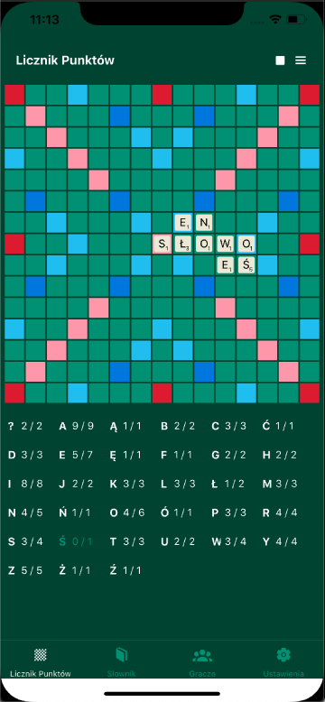
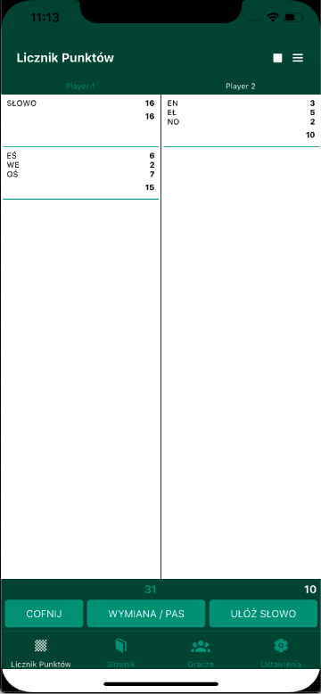
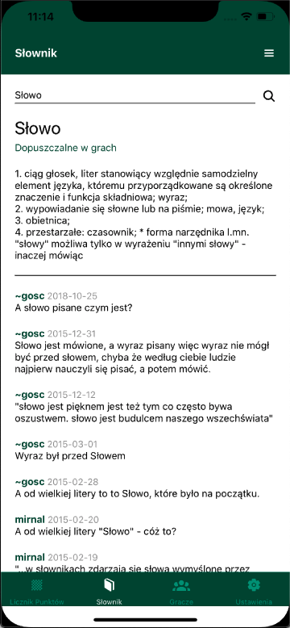
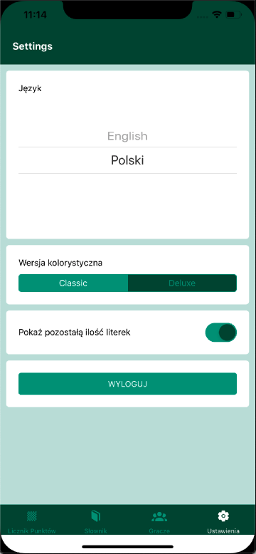

<!-- PROJECT LOGO -->
<br />
<p align="center">
  <a href="https://github.com/KajetanDobczyk/React-Native-Scrabbler">
    
  </a>

  <h3 align="center">Scrabbler</h3>

  <p align="center">
    Scrabble points and tiles counter
  </p>
</p>

<!-- TABLE OF CONTENTS -->
<details open="open">
  <summary>Table of Contents</summary>
  <ol>
    <li>
      <a href="#about-the-project">About The Project</a>
      <ul>
        <li><a href="#built-with">Built With</a></li>
      </ul>
    </li>
    <li>
      <a href="#getting-started">Getting Started</a>
      <ul>
        <li><a href="#prerequisites">Prerequisites</a></li>
        <li><a href="#installation">Installation</a></li>
      </ul>
    </li>
    <li><a href="#usage">Usage</a></li>
    <li><a href="#roadmap">Roadmap</a></li>
  </ol>
</details>

<!-- ABOUT THE PROJECT -->

## About The Project


<br/>
<br/>

This is a side project that I have started in March 2020, during first polish COVID lockdown.

The core functionalities of the in-game part of the app include:

- Starting a new game with 2-4 players, and counting their points all along the game, by adding the used words
- Tracking tiles usage, to show how many of each letter tiles are left in the game
- Skipping the turns (exchanging the letters / getting caught playing non-existing word), reverting the played words
- Ending the game, along with adding and substracting final points from the tiles left on players racks

Additional functionalities:

- Facebook login
- List of allowed 2-letters words, as in tournament rules
- Official national dictionary, for checking if the played words are valid
- Settings allowing to:
  - change the theme to Deluxe version
  - change the language (currently supporting <b>english</b> and <b>polish</b>)
  - turning on/off the remaining tiles counters

### Built With

- [React Native](https://reactnative.dev/)
- [Expo](https://expo.io/)
- [TypeScript](https://www.typescriptlang.org/)
- [Redux Toolkit](https://redux-toolkit.js.org/)
- [i18n](https://www.npmjs.com/package/i18n)

<!-- GETTING STARTED -->

## Getting Started

The app is yet unfinished, so it is only possible to run in development. It was tested mostly on iOS11 emulator.

### Prerequisites

You need expo-cli installed, along with iOS (+XCode) or Android emulators on your local machine. Refer to [original React Native docs](https://reactnative.dev/docs/next/environment-setup) for how to setup your local development environment.

### Installation

1. Clone the repo
   ```sh
   git clone git@github.com:KajetanDobczyk/React-Native-Scrabbler.git
   ```
2. Install the dependencies
   ```sh
   yarn install
   ```
3. Start the app by running
   ```
   npm start
   ```

This will open Expo Development Tools on http://localhost:19002/. From there you can open the app in your local emulators.

<!-- USAGE EXAMPLES -->

## Usage

The app has 4 main tabs

### Points Counter


<br/>
Used to count points and follow the playthrough of the game. You can swipe horizontally between two in-game views after you define the players: points counter, and board view.

### Dictionary


<br/>
Used to count points and follow the playthrough of the game. You can swipe horizontally between two in-game views after you define the players: points counter, and board view.

### Players

List of players and games history <i>(in development)</i>

### Settings



<!-- ROADMAP -->

## Roadmap

TODO (priority):

- Finishing english localization - english alphabet, 2-letter words, dictionary
- Players history - statistics, played games and their histories
- Unit and integration tests
- Deploy to AppStore

TODO (v2):

- Showing chances of drawing given letter in %
- Time counter
- List of own letters (rack)
- Showing points before approving the move
- Showing most profitable possible moves
- Better graphics and animations (e.g. coloring the bonuses on letters tiles)
